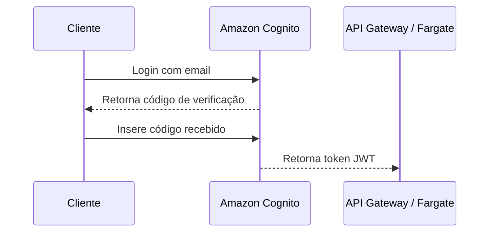

# train-to-level-up

🔥 AWS Services Utilizados
-  Backend (API REST - NestJS)
    - ECS Fargate → Para rodar a API sem precisar gerenciar servidores.
    - API Gateway → Para expor a API REST de forma segura.
    - Amazon RDS (PostgreSQL) → Para armazenar dados estruturados (usuários, progressos, exercícios).
-  Eventos e Processos Assíncronos
    - AWS EventBridge → Para disparar eventos no jogo (XP ganho, batalhas, recompensas).
    - AWS Lambda → Para processar eventos do jogo (cálculo de XP, envio de notificações).
-  Armazenamento e Outros Serviços
    - Amazon S3 → Para armazenar imagens dos jogadores e assets do jogo.
    - Amazon CloudWatch → Para logs e monitoramento da infraestrutura.
    - Amazon ECR → Para armazenar a imagem Docker da API.
- Infraestrutura e Automação
    - Terraform → Para provisionar toda a infraestrutura automaticamente.
    - AWS IAM → Para controle de permissões entre serviços.

📌 Fluxo de Dados
 - O usuário interage com o frontend (React Native - Expo), que faz chamadas à API REST via API Gateway.
 - A API no ECS Fargate processa as requisições e grava dados no RDS PostgreSQL.
 - Se houver um evento importante (exemplo: usuário completou um treino), a API publica um evento no EventBridge.
 - O EventBridge dispara uma AWS Lambda para processar a lógica (exemplo: calcular XP e recompensas).
 - A Lambda pode atualizar o RDS ou enviar notificações ao usuário.
 - O usuário recebe feedback no frontend, seja via API ou notificações.

## Login flow
