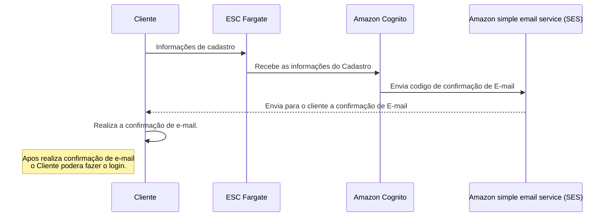
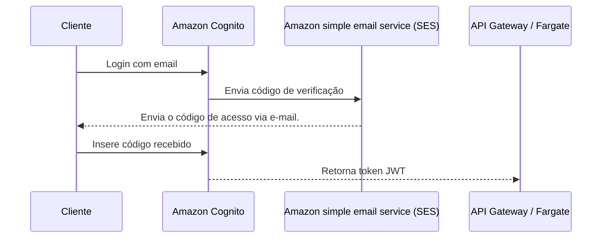

# train-to-level-up

[descrever algo]

## Big Picture

## Cadastro

```mermaid
sequenceDiagram
    participant Cliente
    participant Fargate as ESC Fargate
    participant Cognito as Amazon Cognito
    participant SES as Amazon simple email service (SES)

    Cliente->>Fargate:  Informações de cadastro
    Fargate->>Cognito: Recebe as informações do Cadastro
    Cognito->>SES: Envia codigo de confirmação de E-mail
    SES-->>Cliente: Envia para o cliente a confirmação de E-mail
    Cliente->>Cliente: Realiza a confirmação de e-mail.
    note left of Cliente: Apos realiza confirmação de e-mail <br/> o Cliente podera fazer o login.
```

## Login

```mermaid
sequenceDiagram
    participant Cliente
    participant Cognito as Amazon Cognito
    participant SES as Amazon simple email service (SES)
    participant API as API Gateway / Fargate

    Cliente->>Cognito:  Login com email
    Cognito->>SES:  Envia código de verificação
    SES-->>Cliente: Envia o código de acesso via e-mail.
    Cliente->>Cognito:  Insere código recebido
    Cognito-->>API:  Retorna token JWT
```

##
