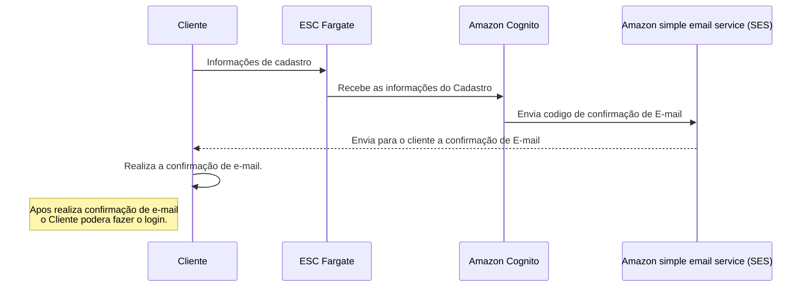
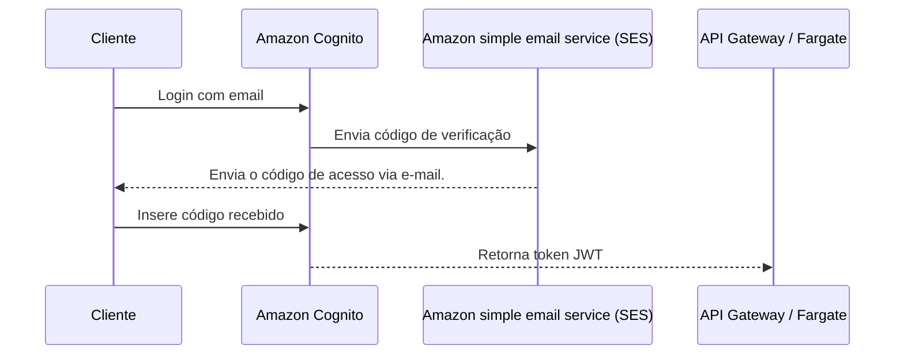
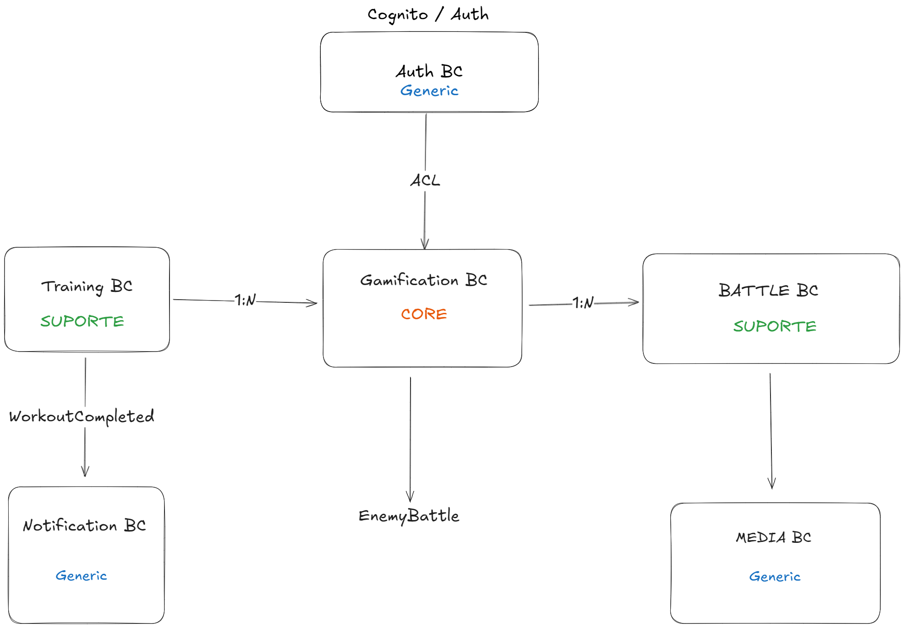

# train-to-level-up

[descrever algo]

## Big Picture

## Cadastro

## Login

##

## Bounded Contexts
### Training context
- Escopo: Tudo que envolve criacao, registro, validacao de sessoes de treino
- Principais resposabilidades
  - Catalago de exercicios
  - composicao de treino
  - registro de sessaoe garatir que seja 1 treino por dia
  - emitir evento como `workoutCompleted` e `workoutSession`

### Gamification Context
- Escopo: Converter treino em progresso de `Game`.
- Principais responsabilidades
  - calculo de XP a partir de sessoes de treino concluidas
  - regras de level up e evolucao do user
  - geracao de batalhas com inimigos
  -  emitir evento como `EnemyBattle`, `LevelUp`, `XPGranted`

### Battle Context
- Escopo: Logica de combate estilo RPG entre usuario e inimigos
- Principais Responsabilidades:
  - calculo de Dano, HP
  - Turnos de ataques, defesa
  - resultado do combate
  - emitir eventos como `EnemyDefeated` ou `UserDefeated`
  (pode ser um subdominio de Gamification)

### Auth Context
- Escopo: Autenticacao e gerenciamento de usuario
- Principais responsabilidades
  - Cadastro, login, tokens (cognito)
  - Tradução de sub Cognito ⇄ UserId de domínio
  - ACL e Anti-Corruption Layer do Cognito

### Notification Context
- Escopo: Envio de notificacao a partir dos eventos do dominio
- Principais Responsabilidades
  - assinar eventos de dominio
  - dispara emails
  - template de mensagens e regras de disparo.

### Media Context
- Escopo: Gestao de sprites e imagens
- Principais responsabilidades
  - Gerenciamento de imagens no S3
  - Geracao de urls assinadas do S3
  - Versonamento de Sprites

### Bounded Context Map

